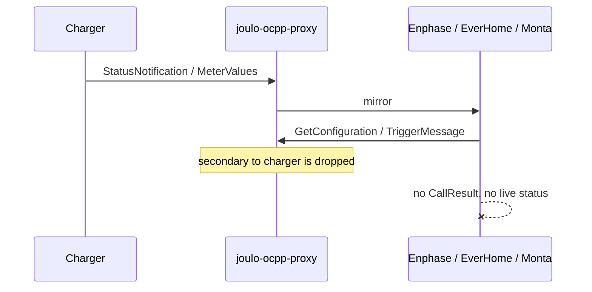
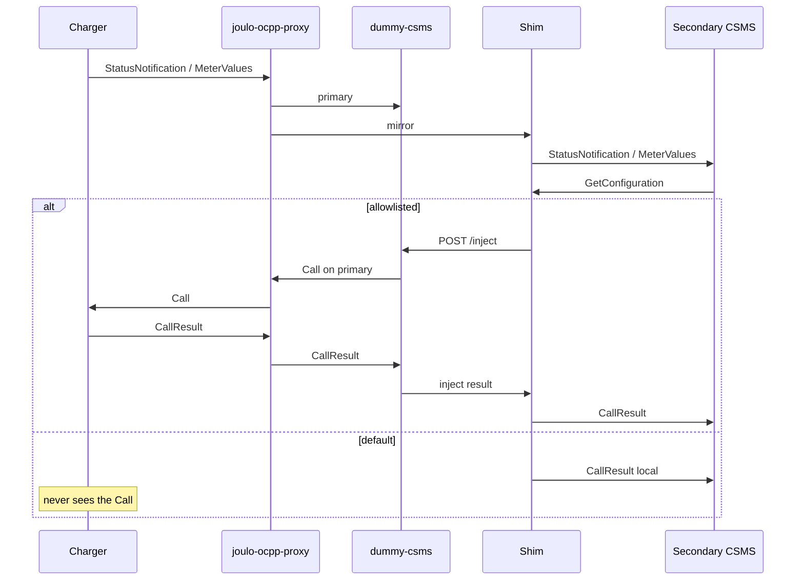

# ocpp-fanout

[](https://github.com/cbrandlehner/ocpp-fanout/actions/workflows/ci.yml)
[](https://github.com/cbrandlehner/ocpp-fanout/actions/workflows/codeql.yml)
[](https://github.com/cbrandlehner/ocpp-fanout/actions/workflows/dependency-review.yml)
[](LICENSE)
[](https://openchargealliance.org/)
[](https://docs.docker.com/compose/)
[](#disclaimer)
[](https://github.com/sponsors/cbrandlehner)

Most wallboxes expose **one** OCPP slot. You still want a local controller
(MQTT, HTTP, Modbus) to set current and phases. At the same time, backends such
as an Enphase IQ Energy Router, EverHome, or Monta should see **live** data —
without silently taking over the charger.

**ocpp-fanout** sits in front of the wallbox: a splitter, a dummy primary, and
small answering shims. The splitter is
[joulo-ocpp-proxy](https://github.com/joulo-nl/joulo-ocpp-proxy). The shims exist
because Joulo alone cannot keep those secondaries alive.

A web UI on the same host shows the live packet flow and lets you choose, per
backend, which CSMS commands may reach the charger.

> **Disclaimer.** ocpp-fanout is an independent, no-support open-source project.
> It is not affiliated with, endorsed by, or supported by go-e, Enphase,
> everHome, Monta, Joulo, Tesla, or any other vendor whose products it can talk
> to. Use it at your own risk.

German: [docs/ANLEITUNG.md](docs/ANLEITUNG.md).


<video src="docs/video/ocpp-fanout.mp4" controls playsinline width="100%"></video>

## What it is for

| Goal | Who |
|------|-----|
| Charging, phases, start/stop | **Local controller** (MQTT / Enphase, not OCPP) |
| Charger stays OCPP-online | dummy-csms as primary (answers; optional inject) |
| Enlighten / EverHome / Monta see live data | Secondaries via shims |
| Selected CSMS commands may reach the box | Setup allowlist → dummy inject through Joulo |
| Everything else stays off the wallbox | Shim answers locally, UI shows **dropped** |

The wallbox points at **one** WebSocket: `ws://<host>:<port>/<chargePointId>`.

## Why joulo-ocpp-proxy

Joulo is a thin OCPP WebSocket proxy: one inbound connection, one primary with
full control, any number of secondaries as a mirror. That is the 1→N split the
single slot needs.

| Direction | Primary | Secondary |
|----------|---------|-----------|
| Charger → CSMS | forwarded | mirrored |
| CSMS → Charger | forwarded | **dropped** |

That drop is the point: a secondary must not remote-control the box unless
ocpp-fanout explicitly allows a command.

## Why Joulo is not enough

Many “monitor” backends are still a full CSMS. They send **Calls** toward the
charger (`GetConfiguration`, `TriggerMessage`, …). Joulo discards
secondary → charger, so those Calls never arrive, there is no CallResult, and
the vendor app has no live data (historical kWh may still show).



Gaps Joulo does not close:

1. **Enphase IQ Energy Router** keeps sending `GetConfiguration` and
   `TriggerMessage(StatusNotification)`. Without a local answer, Enlighten stays
   empty even if the WebSocket is up.
2. **EverHome** speaks WebSocket **without** the `ocpp1.6` subprotocol. Joulo
   fails with `Server sent no subprotocol`.
3. **Monta** needs CallResults, optional `RemoteStart`, and a coherent
   `StartTransaction` / `transactionId`. Joulo never forwards secondary control,
   and the dummy’s transaction ids are not Monta’s.
4. Joulo has a **single** `SECONDARY_CSMS_APPEND_CHARGE_POINT_ID` flag. Enphase
   wants `ws://…:8083/<id>`; EverHome and Monta often already include identity
   in the URL.


## What ocpp-fanout adds

A shim sits between Joulo and each picky secondary. Joulo sees a normal OCPP 1.6
peer. The shim talks upstream the way that vendor actually behaves.

- Default: answer CSMS Calls **locally** (never toward the wallbox).
- Allowlist (Setup): selected Calls are injected on the **primary** link
  (`POST /inject` on dummy-csms) so Joulo forwards them to the Gemini.
- Spec-valid local replies for RFID list / clear profile (`Accepted`) without
  writing the charger.
- For Monta: remap `transactionId` on MeterValues / StopTransaction to the id
  Monta assigned; replay `StartTransaction` if a session is already open.



### Dummy as primary

The charger needs a primary that returns CallResults (`[3, id, payload]`), or it
goes offline. dummy-csms does that. It does **not** originate control itself.
`POST /inject` is the only way a shim can send a CSMS Call through Joulo to the
box.

### Web UI

`http://<host>:8088/` — Live packet scene (dark / light), Setup (backends +
allowlist), Theme. Allowed commands apply immediately. Restart the stack only
after changing URLs.

While charging, the EV card shows phases, A per phase, and kW from MeterValues
(`Current.Import` L1/L2/L3 and `Power.Active.Import`).

## Components

| Service | Image / role |
|---------|----------------|
| **joulo-ocpp-proxy** | `ghcr.io/joulo-nl/joulo-ocpp-proxy` — 1→N split |
| **dummy-csms** | local image — primary + `/inject` |
| **enphase-shim** | local image (same shim) — Enphase |
| **everhome-shim** | same image — EverHome (no `ocpp1.6` subprotocol) |
| **monta-shim** | same image — Monta |
| **ui** | FastAPI — Live / Setup / daily JSONL log |

`proxy/entrypoint.sh` builds upstream URLs **per** secondary.

| Upstream | Append charge point id | Why |
|----------|------------------------|-----|
| Dummy (primary) | yes | `ws://dummy-csms:9001/<id>` |
| Enphase via shim | yes | OCPP-J: `ws://<router>:8083/<id>` |
| EverHome via shim | as in the app URL | serial already in path |
| Monta via shim | no | `wss://ocpp.monta.app/goe<serial>` |

## Install

Two Compose files:

| File | Use |
|------|-----|
| [`docker-compose.yml`](docker-compose.yml) | Healthchecks and rotated json-file logs. Backend URLs may come from `.env`. |
| [`docker-compose.simple.yml`](docker-compose.simple.yml) | No healthchecks, Docker default logging. Charge point id, backend URLs, and allowlists are set in the **Setup** UI only. |

```bash
cp .env.example .env
# full stack (env URLs optional):
docker compose up -d --build
# or simple:
docker compose -f docker-compose.simple.yml up -d --build
```

| | |
|--|--|
| Wallbox OCPP | `ws://<this-host>:9100/<CHARGE_POINT_ID>` |
| Web UI | `http://<this-host>:8088/` |

**Portainer:** add a stack from the same `docker-compose.yml` and paste `.env` as
stack environment (or point Portainer at this repository). Compose **builds**
`dummy-csms`, `everhome-shim`, and `ui` locally; the Joulo image comes from
`ghcr.io`.

After start, open Setup in the UI to confirm URLs and the command allowlist.
Allowed commands apply immediately. Restart the stack only after changing
backend URLs in `.env`.

OCPP Calls including payload go to the `ui-data` volume:
`ocpp-commands-YYYY-MM-DD.jsonl` (today + yesterday, max 80 MB per day).

Do not commit `.env`.

### Troubleshooting

| Symptom | Cause / fix |
|---------|-------------|
| Vendor app empty / offline | Shim must answer Calls Joulo would drop. Check `docker compose logs`. |
| EverHome offline | Needs the shim (no `ocpp1.6` subprotocol). |
| Enlighten no live data | Allow `TriggerMessage:StatusNotification` in Setup. |
| Enphase amps jump | Router in **Monitor** mode; keep `SetChargingProfile` off the allowlist. |
| Charger OCPP-offline | Dummy must return CallResults. |
| Monta live OK, empty charge log | Needs `StartTransaction` with an idTag Monta accepts. AutoStart in Monta Hub requires Private visibility and EVSE support for `RemoteStart`. |
| Monta shows Paused | OCPP `SuspendedEVSE` / `SuspendedEV` at 0 W — session open, no energy. |
| Packets never “from Monta” | Monta mostly receives; it rarely sends (e.g. `Trigger MeterValues`). |

## Disclaimer

ocpp-fanout is community software. None of the integrated products’ vendors
provide support for this stack, and this repository does not offer a support
contract either. Names of chargers, CSMS platforms, and other hardware appear
only to describe interoperability.

## License

Joulo: [MIT](https://github.com/joulo-nl/joulo-ocpp-proxy/blob/main/LICENSE),
[joulo.nl](https://joulo.nl). ocpp-fanout adds dummy, shims, and UI; it does not
replace Joulo.

Photos: go-e Gemini from the [go-e Shop](https://shop.go-e.com/); Enphase IQ
Energy Router from [enphase.com](https://enphase.com/); EcoTracker from
[everHome](https://everhome.cloud/); Tesla Model S cutouts are product-style
studio shots of the facelift Model S (white in dark mode, black in light mode).
