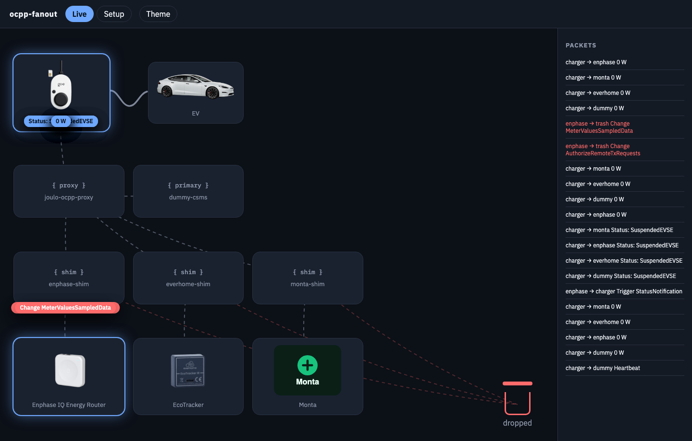
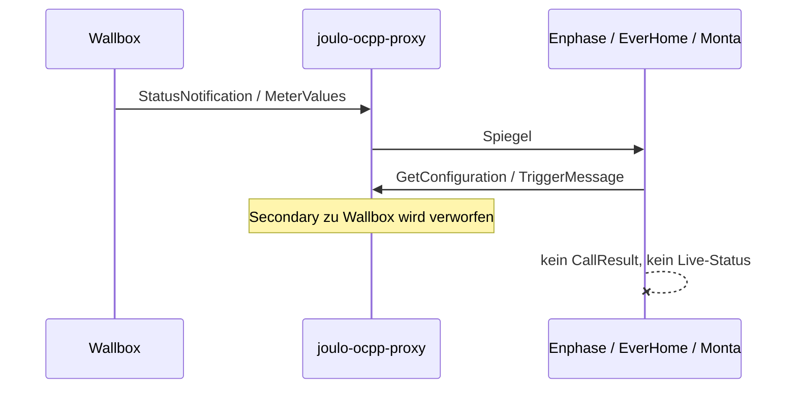
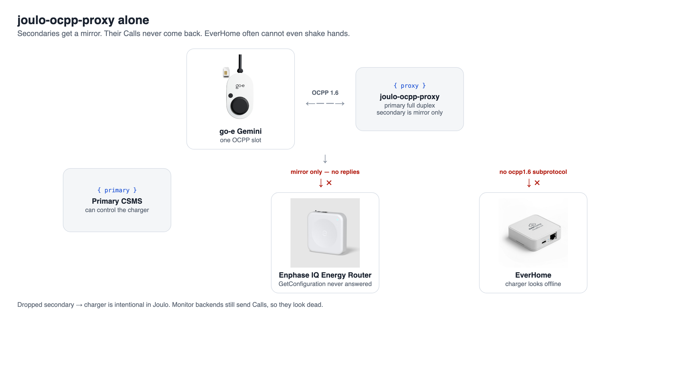
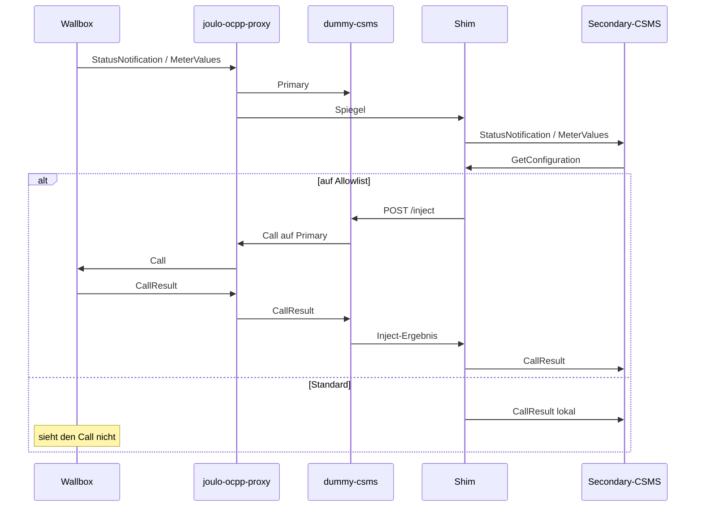

# ocpp-fanout

> **Hinweis.** ocpp-fanout ist ein unabhängiges Open-Source-Projekt ohne
> Herstellersupport. Es steht in keiner Verbindung zu go-e, Enphase, everHome,
> Monta, Joulo, Tesla oder anderen Anbietern, deren Produkte es ansprechen
> kann, und wird von diesen weder unterstützt noch empfohlen. Nutzung auf
> eigene Gefahr.

Die meisten Wallboxen haben **einen** OCPP-Slot. Lokal soll trotzdem der eigene
Regler laden (MQTT, HTTP, Modbus). Gleichzeitig wollen Dienste wie ein Enphase
IQ Energy Router, EverHome oder Monta **live** mitlesen — ohne die Box still
zu übernehmen.

**ocpp-fanout** hängt vor die Wallbox einen Splitter, ein Dummy-Primary und
kleine Antwort-Shims. Der Splitter ist
[joulo-ocpp-proxy](https://github.com/joulo-nl/joulo-ocpp-proxy). Die Shims sind
nötig, weil Joulo allein die Secondaries nicht am Leben hält.

Eine Web-UI auf demselben Host zeigt den Live-Datenfluss und lässt pro Backend
wählen, welche CSMS-Befehle die Wallbox erreichen dürfen.

Englisch: [README.md](../README.md).



<video src="video/ocpp-fanout.mp4" controls playsinline width="100%"></video>

## Wofür

| Ziel | Wer |
|------|-----|
| Laden, Phasen, Start/Stop | **lokaler Regler** (MQTT / Enphase, nicht OCPP) |
| Box bleibt OCPP-online | Dummy-CSMS als Primary (antwortet; optional Inject) |
| Enlighten / EverHome / Monta sehen Live-Daten | Secondaries über Shims |
| Ausgewählte CSMS-Befehle dürfen zur Box | Setup-Allowlist → Dummy-Inject durch Joulo |
| Alles andere bleibt von der Box fern | Shim antwortet lokal, UI zeigt **dropped** |

Die Wallbox zeigt auf **einen** WebSocket: `ws://<host>:<port>/<chargePointId>`.

## Warum joulo-ocpp-proxy

Joulo ist ein schlanker OCPP-WebSocket-Proxy: eine eingehende Verbindung, ein
Primary mit voller Kontrolle, beliebig viele Secondaries als Spiegel. Genau die
1→N-Aufteilung, die der eine Slot braucht.

| Richtung | Primary | Secondary |
|----------|---------|-----------|
| Wallbox → CSMS | weitergeleitet | gespiegelt |
| CSMS → Wallbox | weitergeleitet | **verworfen** |

Das ist gewollt: ein Secondary darf die Box nicht fernsteuern, außer ocpp-fanout
lässt einen Befehl ausdrücklich durch.

## Warum Joulo allein nicht reicht

Viele „Monitor“-Backends sind trotzdem ein volles CSMS. Sie schicken **Calls**
zur Box (`GetConfiguration`, `TriggerMessage`, …). Joulo wirft Secondary →
Wallbox weg. Die Calls kommen nie an, es gibt kein CallResult, die App bleibt
ohne Live-Daten.



Lücken, die Joulo so nicht schließt:

1. **Enphase IQ Energy Router** sendet laufend `GetConfiguration` und
   `TriggerMessage(StatusNotification)`. Ohne lokale Antwort bleibt Enlighten
   tot.
2. **EverHome** spricht WebSocket **ohne** Subprotokoll `ocpp1.6`. Joulo bricht
   mit `Server sent no subprotocol` ab.
3. **Monta** braucht CallResults, optional `RemoteStart` und stimmige
   `StartTransaction` / `transactionId`. Joulo leitet Secondary-Steuerung nicht
   weiter, und die Dummy-Transaktions-IDs sind nicht Montas.
4. Joulo hat nur **einen** Schalter `SECONDARY_CSMS_APPEND_CHARGE_POINT_ID`.
   Enphase braucht `ws://…:8083/<id>`; EverHome und Monta haben die Identität
   oft schon in der URL.



## Was ocpp-fanout ergänzt

Zwischen Joulo und jedem knickrigen Secondary sitzt ein Shim. Joulo sieht einen
normalen OCPP-1.6-Peer. Der Shim spricht upstream so, wie der Vendor es wirklich
tut.

- Standard: CSMS-Calls **lokal** beantworten (nie zur Wallbox).
- Allowlist (Setup): ausgewählte Calls werden auf der **Primary**-Leitung
  injiziert (`POST /inject` am Dummy), damit Joulo sie zum Gemini schickt.
- Spec-konforme lokale Antworten für RFID-Liste / Clear Profile (`Accepted`),
  ohne die Box zu beschreiben.
- Für Monta: `transactionId` auf MeterValues / StopTransaction auf die von
  Monta vergebene ID mappen; `StartTransaction` nachspielen, wenn schon eine
  Session offen ist.



### Dummy als Primary

Die Box muss irgendwohin einen Primary haben, der CallResults liefert
(`[3, id, payload]`), sonst gilt sie als offline. dummy-csms tut das. Eigene
Ladesteuerung sendet er nicht. `POST /inject` ist der einzige Weg, über Joulo
einen CSMS-Call zur Box zu schicken. Unter Setup kann ein
StatusNotification-Poll (Primary-`TriggerMessage`) mit getrennten Intervallen
für Laden und Idle laufen.

### Web-UI

`http://<host>:8088/` — Live-Datenfluss (Dark / Light), Setup (Backends +
Allowlist + Status-Intervalle), Theme. Erlaubte Befehle und Status-Intervalle
gelten sofort. Stack nur nach URL-Änderung neu starten.

Beim Laden zeigt die EV-Karte Phasen, Ampere je Phase und kW aus den
MeterValues (`Current.Import` L1/L2/L3 und `Power.Active.Import`).

## Komponenten

| Dienst | Image / Rolle |
|--------|----------------|
| **joulo-ocpp-proxy** | `ghcr.io/joulo-nl/joulo-ocpp-proxy` — Split 1→N |
| **dummy-csms** | lokales Image — Primary + `/inject` |
| **enphase-shim** | lokales Image (derselbe Shim) — Enphase |
| **everhome-shim** | dasselbe Image — EverHome (kein `ocpp1.6`-Subprotokoll) |
| **monta-shim** | dasselbe Image — Monta |
| **ui** | FastAPI — Live / Setup / tägliches JSONL-Log |

`proxy/entrypoint.sh` setzt die Upstream-URLs **pro** Secondary.

| Upstream | Charge-Point-ID an die URL | Warum |
|----------|----------------------------|--------|
| Dummy (Primary) | ja | `ws://dummy-csms:9001/<id>` |
| Enphase über Shim | ja | OCPP-J: `ws://<router>:8083/<id>` |
| EverHome über Shim | wie in der App-URL | SN oft schon enthalten |
| Monta über Shim | nein | `wss://ocpp.monta.app/goe<serial>` |

## Installation

Zwei Compose-Dateien:

| Datei | Zweck |
|------|--------|
| [`docker-compose.yml`](../docker-compose.yml) | Healthchecks und rotierte json-file-Logs. Backend-URLs dürfen aus `.env` kommen. |
| [`docker-compose.simple.yml`](../docker-compose.simple.yml) | Keine Healthchecks, Docker-Default-Logging. Charge-Point-ID, Backend-URLs und Allowlist nur in der **Setup**-UI. |

```bash
cp .env.example .env
# voller Stack (URLs in .env optional):
docker compose up -d --build
# oder einfach:
docker compose -f docker-compose.simple.yml up -d --build
```

| | |
|--|--|
| Wallbox-OCPP | `ws://<dieser-Host>:9100/<CHARGE_POINT_ID>` |
| Web-UI | `http://<dieser-Host>:8088/` |

**Portainer:** Stack aus derselben `docker-compose.yml` anlegen, `.env` als
Stack-Umgebung einfügen (oder dieses Repository einbinden). Compose **baut**
`dummy-csms`, `everhome-shim` und `ui` lokal; Joulo kommt von `ghcr.io`.

Danach in der UI unter Setup URLs, Allowlist und die StatusNotification-Intervalle
prüfen (Standard 60 s beim Laden, 7 s im Idle). Erlaubte Befehle und diese
Intervalle gelten sofort. Stack nur neu starten, wenn sich Backend-URLs in
`.env` geändert haben.

OCPP-Calls inkl. Payload liegen im Volume `ui-data`:
`ocpp-commands-YYYY-MM-DD.jsonl` (heute + gestern, max. 80 MB pro Tag).

`.env` nicht committen.

### Troubleshooting

| Symptom | Ursache / Fix |
|---------|----------------|
| Vendor-App leer / offline | Shim muss Calls beantworten, die Joulo verwerfen würde. `docker compose logs`. |
| EverHome offline | Shim nötig (kein `ocpp1.6`-Subprotokoll). |
| Enlighten ohne Live-Daten | dummy-csms pollt `StatusNotification` selbst. Enphase-`TriggerMessage` nicht auf die Allowlist, außer der Router soll die Box zusätzlich anstoßen. |
| Enphase-Ampere springt | Router auf **Monitor**; `SetChargingProfile` nicht auf die Allowlist. |
| Wallbox OCPP-offline | Dummy muss CallResults liefern. |
| Monta live OK, Ladeprotokoll leer | Braucht `StartTransaction` mit einem idTag, den Monta akzeptiert. AutoStart im Hub nur bei Private und wenn die EVSE `RemoteStart` kann. |
| Monta zeigt Paused | OCPP `SuspendedEVSE` / `SuspendedEV` bei 0 W — Session offen, kein Strom. |
| Packets nie „von Monta“ | Monta empfängt vor allem; sendet selten (z. B. `Trigger MeterValues`). |

## Hinweis

ocpp-fanout ist Community-Software. Keiner der genannten Hersteller leistet
Support für diesen Stack, und dieses Repository bietet auch keinen
Support-Vertrag. Produktnamen dienen nur der Beschreibung der Anbindung.

## Lizenz

Joulo: [MIT](https://github.com/joulo-nl/joulo-ocpp-proxy/blob/main/LICENSE),
[joulo.nl](https://joulo.nl). ocpp-fanout ergänzt Dummy, Shims und UI; es
ersetzt Joulo nicht.

Fotos: go-e Gemini aus dem [go-e Shop](https://shop.go-e.com/); Enphase IQ
Energy Router von [enphase.com](https://enphase.com/); EcoTracker von
[everHome](https://everhome.cloud/); Tesla Model S freigestellt als
Produktstudio-Aufnahmen des Facelift-Model-S (weiß im Dark Mode, schwarz im
Light Mode).
